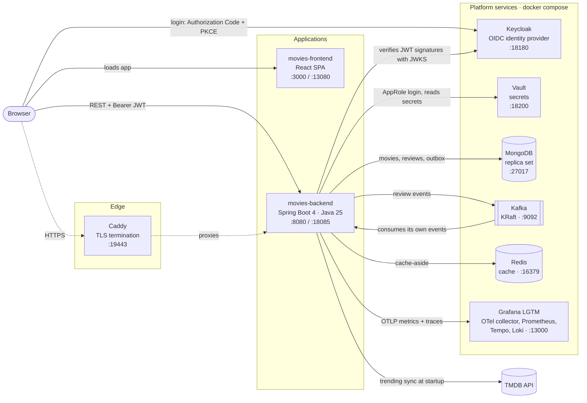
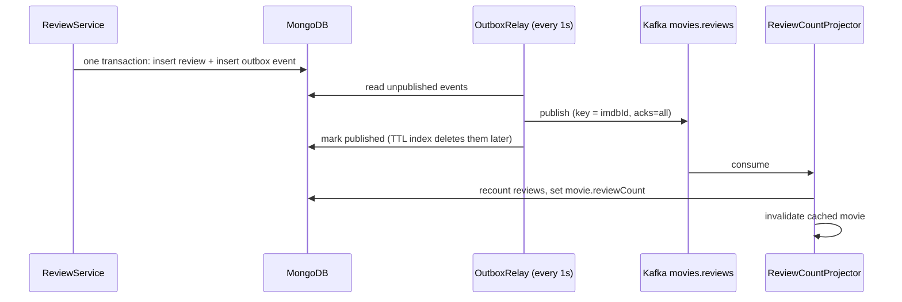

# Movie Gold

A movie hub for people who are too busy to watch everything: each week's trending movies with a short
synopsis, ratings, trailers and the best reviews, plus your own reviews.

It is also a learning project. It starts as a small Spring Boot + React CRUD app and grows step by step
into a production-shaped system: an identity provider, secrets management, TLS, an event pipeline,
caching, observability, CI and containers. Later it will add AI inference and AI infrastructure.

---

## Architecture



### What each part does

| Component | Role |
|---|---|
| **movies-frontend** (`movies-frontend/`) | React single-page app. It lists the trending movies (hero carousel), shows trailers, and has a page per movie with the synopsis, TMDB viewer reviews and the app's own paged reviews. It signs in through Keycloak with `react-oidc-context` and sends the access token as `Authorization: Bearer`. |
| **movies-backend** (`movies-backend/`) | Spring Boot REST API (`/api/v1/...`) and an OAuth2 *resource server*: it never sees passwords and only checks tokens. It owns the movie catalogue (synced from TMDB), reviews, the event pipeline and the cache. |
| **Keycloak** (`keycloak/`) | Identity provider. It handles login, registration, password policy, brute-force protection and roles (`USER`, `ADMIN`). The realm is code: `keycloak/import/movie-gold-realm.json` is imported on first start. |
| **MongoDB** | System of record: `movies`, `reviews`, `outbox_events`. It runs as a single-node **replica set**, because multi-document transactions (used by the outbox) need one. |
| **Kafka** | Event log. Review changes are published to `movies.reviews`. Failed messages go to `movies.reviews-dlt` (dead-letter topic). |
| **Redis** | Read cache for movie responses (cache-aside). It is optional at runtime: if Redis is down, the API still answers from MongoDB. |
| **Vault** | Optional secrets store. With `VAULT_ENABLED=true` the backend logs in with AppRole and reads the Mongo URI and TMDB token from `secret/movies`. Those values are then not needed in `.env`. |
| **Caddy** (`caddy/`) | Optional TLS reverse proxy (`--profile tls`) in front of the backend, with a locally trusted CA. A second Caddy serves the built frontend inside its container. |
| **Grafana LGTM** | Development observability stack: an OpenTelemetry collector plus Prometheus (metrics), Tempo (traces), Loki (logs) and Grafana. |
| **TMDB** | External source of trending movies, details, cast and viewer reviews. It is synced once at startup and on demand by an admin. |

### Backend package layout

The backend is split **by feature, not by layer**, and ArchUnit tests enforce the boundaries
(`ArchitectureTest`: controllers don't touch repositories, no package cycles).

| Package | Contents |
|---|---|
| `movie` | `Movie` document, repository, service, controller, DTOs, `MovieCache` |
| `review` | `Review` document (points at its movie by `imdbId`), create/delete with ownership checks, paged reviews per movie, `ReviewEvent`, `ReviewCountProjector` (Kafka consumer), startup migrations |
| `outbox` | Transactional outbox: `OutboxEvent`, `Outbox` (writes inside the caller's transaction), `OutboxRelay` (publishes to Kafka) |
| `tmdb` | TMDB client, mapper, startup `TrendingMoviesSync`, admin `POST /api/v1/admin/trending-sync` |
| `security` | Security filter chain, JWT decoder (issuer + audience checks), `CurrentUser`, per-client rate limiting |
| `user` | `GET /api/v1/users/me` (who am I, according to the token) |
| `common` | Error handling (RFC 9457 `ProblemDetail`), `PageResponse`, `JsonCache`, Mongo transactions, Kafka error handling, OpenAPI config |

### API

Interactive docs: `http://localhost:8080/swagger-ui.html`. Use **Authorize** there to log in through
Keycloak with PKCE.

| Method & path | Who | What |
|---|---|---|
| `GET /api/v1/movies?page&size` | anyone | This week's trending movies, paged (cached) |
| `GET /api/v1/movies/{imdbId}` | anyone | One movie with synopsis, cast, TMDB reviews, `reviewCount` (cached) |
| `GET /api/v1/movies/{imdbId}/reviews?page&size` | anyone | The app's reviews for a movie, newest first |
| `POST /api/v1/reviews` | `USER` | Write a review. The author comes from the token, never from the body. |
| `DELETE /api/v1/reviews/{id}` | author or `ADMIN` | Delete a review. Anyone else gets 403. |
| `GET /api/v1/users/me` | logged in | The caller's id, username and roles |
| `POST /api/v1/admin/trending-sync` | `ADMIN` | Re-sync trending movies from TMDB now |
| `GET /actuator/health`, `/actuator/info` | anyone | Liveness/readiness probes |
| `GET /actuator/**` (metrics, …) | `ADMIN` | Operational endpoints |

Errors are `application/problem+json`. A request over the rate limit gets `429` with a `Retry-After` header.

---

## Key flows

### Logging in (OIDC Authorization Code + PKCE)

1. The SPA creates a random `code_verifier` and sends its SHA-256 hash (`code_challenge`) to Keycloak.
2. The user logs in or registers **on Keycloak's page**, so the app never handles passwords.
3. Keycloak redirects back with a one-time `code`. The SPA exchanges it, together with the verifier, for tokens.
   A stolen code is useless without the verifier.
4. The access token is a short-lived (5 min) RS256 JWT with `roles` and `aud: movie-gold-api`. It is kept in
   `sessionStorage` and renewed silently.
5. The backend checks the signature (against Keycloak's public keys, JWKS), the issuer, the expiry and the
   audience. Then it maps `roles` to Spring authorities.

### Writing a review: transactional outbox → Kafka



* **Why an outbox?** Writing to MongoDB and then to Kafka is two systems with no shared transaction.
  A crash between the two writes would lose the event, or publish an event for a write that rolled back.
  The outbox makes the event part of the same database transaction. A relay then delivers it
  **at least once**.
* **At least once means duplicates are possible**, so the consumer is **idempotent**. It doesn't do
  `+1`/`-1`. It recounts the movie's reviews and *sets* `reviewCount`, so the same event applied twice gives
  the same result.
* **Poison messages**: after a few retries a failing message goes to `movies.reviews-dlt` instead of
  blocking the partition.
* Keying by `imdbId` keeps all events for one movie in order, on the same partition.

### Reading movies: cache-aside with generation invalidation

`MovieCache` tries Redis first. On a miss it loads from MongoDB and stores the JSON with a TTL (10 min).
Cache keys include a **generation number**. Invalidating "all movie lists" just increments the
generation, so the old keys are never read again and expire on their own, without a `KEYS`/`SCAN` sweep.
Redis has short timeouts (250 ms), and any Redis error is logged and treated as a miss, so a cache
outage slows the API down but never breaks it.

### Startup

1. With Vault enabled, secrets are loaded before anything else (`spring.config.import`).
2. Idempotent migrations run in order: link old reviews to their movie (`ReviewMovieLinkMigration`), then
   backfill `reviewCount` (`ReviewCountBackfill`). Running them twice does nothing.
3. Once the server is up, `TrendingMoviesSync` pulls this week's trending movies from TMDB. It is skipped if no
   token is configured, and a TMDB failure is logged, not fatal.

---

## Security model

| Concern | How it's handled |
|---|---|
| Authentication | Keycloak (OIDC). The backend only validates JWTs: signature (JWKS), issuer, audience, expiry. |
| Authorization | Roles in the token (`USER`, `ADMIN`) plus ownership checks in the service: only the author or an admin can delete a review. This prevents BOLA/IDOR. |
| Passwords | Never touch the app. Keycloak enforces 15–64 characters, not the username, and brute-force lockout. |
| Secrets | `.env` files are git-ignored (only `*.example` is committed). Optionally they live in Vault, read with a least-privilege AppRole policy. gitleaks scans every push. |
| Transport | Caddy terminates TLS (`--profile tls`). Forwarded headers are trusted, so the app sees `https`. HSTS can be configured. |
| Abuse | Per-client token-bucket rate limits (Bucket4j). Reads and writes have separate budgets. Over the limit returns `429` + `Retry-After`. |
| Browser | CORS allow-list, security headers. Tokens go in `sessionStorage`, not cookies, so no CSRF surface. |
| Containers | Non-root users, `.dockerignore` keeps `.env` out of images, JRE-only runtime image. |

---

## Running it locally

### Prerequisites

Docker Desktop, JDK 25, Node 22, and PowerShell (for the helper scripts).

### Port map

Windows reserves several port ranges for Hyper-V/WSL (e.g. 8000–8554, 6274–6473, around 4317), which is why
some ports look unusual.

| Port | Service |
|---|---|
| 3000 | Frontend dev server (`npm start`) |
| 8080 | Backend on the host (`mvnw spring-boot:run`; change with `SERVER_PORT`) |
| 13080 | Frontend container (`--profile app`) |
| 18085 | Backend container (`--profile app`) |
| 18180 | Keycloak (admin console + login pages) |
| 27017 | MongoDB |
| 9092 | Kafka for apps on the host (containers use `kafka:29092`) |
| 16379 | Redis |
| 18200 | Vault |
| 19443 | Caddy HTTPS → backend (`--profile tls`) |
| 13000 | Grafana (admin / admin) |
| 14317 / 14318 | OTLP gRPC / HTTP |

### 1. Platform services

```bash
cp .env.example .env                 # then fill in the values (strong, random)
docker compose up -d                 # keycloak, mongo, kafka, redis, vault, observability
powershell -File keycloak/create-dev-users.ps1   # dev users movie_fan_42 (USER) and movie_fan_43 (ADMIN)
```

The dev users' password is `KEYCLOAK_DEV_USER_PASSWORD` in the root `.env`. Vault runs in dev mode
(in memory), so re-seed it after each restart if you use it (step 4).

### 2. Backend

```bash
cd movies-backend
cp .env.example .env                 # MONGO_URI for local Mongo, or the Atlas values; TMDB_API_TOKEN
./mvnw spring-boot:run
```

`.env` is read as a Java properties file (`spring.config.import=optional:file:.env[.properties]`), so use
`KEY=value` lines with no quotes and no `export`.

### 3. Frontend

```bash
cd movies-frontend
npm ci
npm start                            # http://localhost:3000
```

`.env.development` points the app at `http://localhost:8080`. Put any personal overrides (e.g. a
different backend port) in a git-ignored `.env.development.local`.

### 4. Optional extras

| What | How |
|---|---|
| Secrets from Vault | `powershell -File vault/seed-dev-secrets.ps1`, then `VAULT_ENABLED=true` in the backend `.env` |
| HTTPS | `docker compose --profile tls up -d caddy`, then trust Caddy's root CA and open `https://localhost:19443` |
| Everything in containers | `docker compose --profile app up -d --build` → frontend `http://localhost:13080`, API `http://localhost:18085` (uses the local Mongo) |
| Traces & metrics | Grafana at `http://localhost:13000` → Explore → Tempo (traces) / Prometheus (`app_cache_requests_total`, `app_outbox_events_total`, …) |

---

## Observability

* **Health:** `/actuator/health/liveness` and `/readiness`, ready for Kubernetes probes.
* **Metrics:** Micrometer exports to OTLP every 10 s. Besides JVM/HTTP/Kafka metrics there are custom
  counters for cache hits and misses (`app.cache.requests`) and outbox publishing (`app.outbox.events`).
* **Traces:** Spring's OpenTelemetry starter traces HTTP requests, MongoDB, Redis and Kafka. Trace context
  travels in Kafka headers, so the trace links the relay's send to the consumer's processing.
* Turn export off with `OBSERVABILITY_EXPORT_ENABLED=false`. Tune sampling with `TRACING_SAMPLING_PROBABILITY`.

## Testing

```bash
cd movies-backend && ./mvnw verify   # needs Docker running (Testcontainers)
```

| Layer | Examples |
|---|---|
| Unit | `JsonCacheTest`, `RateLimitFilterTest`, `CurrentUserTest`, `TmdbMovieMapperTest` |
| Slice (`@WebMvcTest`) | controller tests with mocked services and test JWTs (`TestUsers.jwt()`) |
| Integration (Testcontainers) | real MongoDB replica set, Kafka and Redis: `MovieApiIntegrationTest`, `ReviewEventsIntegrationTest` (outbox → Kafka → projector, DLT), `MovieCacheIntegrationTest`, `ReviewMovieLinkMigrationIntegrationTest`, `ActuatorSecurityIntegrationTest` |
| Architecture | `ArchitectureTest` (ArchUnit) |

## CI/CD

`.github/workflows/ci.yml` runs on every push and pull request:

* **backend:** `./mvnw verify` (all tests, including Testcontainers); test reports are uploaded on failure
* **frontend:** `npm ci` and a production build with `CI=true` (warnings fail the build)
* **secrets:** gitleaks scans the history; `.gitleaksignore` lists justified exceptions

Dependabot opens weekly update PRs for Maven, npm, GitHub Actions, the compose images and the Dockerfiles' base images.

## Repository layout

```
.
├── docker-compose.yml        platform services (+ "tls" and "app" profiles)
├── .env.example              compose secrets template (copy to .env)
├── keycloak/                 realm-as-code + dev user script
├── vault/                    dev secrets seeding script (AppRole + policy)
├── caddy/                    TLS reverse proxy config
├── movies-backend/           Spring Boot API (+ Dockerfile)
├── movies-frontend/          React SPA (+ Dockerfile, Caddyfile)
└── .github/                  CI workflow, Dependabot
```

## Known limitations & next steps

Deliberate trade-offs for a single-node development setup, and good next exercises:

* **Rate limits are per instance** (in-memory buckets). With several replicas, move them to Redis
  (Bucket4j has a Redis backend).
* **The outbox relay assumes one instance.** With more, add a lock (e.g. ShedLock) or claim events atomically.
* **The relay starts a new trace.** Store the trace context in the outbox event so a review's HTTP request
  and its Kafka processing appear as one trace.
* **Redis has timeouts but no circuit breaker.** During an outage every request still waits up to 250 ms
  (Resilience4j would skip Redis for a while).
* **Topics have one replica.** The app declares its topics (3 partitions each), but production needs
  replication factor 3 with `min.insync.replicas=2`. It also needs `auto.create.topics.enable=false` on the
  brokers, so a typo can't create a new topic.
* **Dev-mode services:** Keycloak `start-dev` (HTTP, embedded DB), Vault `-dev` (in memory, root token),
  single-broker Kafka, single-node replica set.
* **No Content-Security-Policy yet** on the frontend.
* **Frontend config is baked in at build time** (`REACT_APP_*`), so build one image per environment.

---

## AI inference (Phase 4)

> 🚧 **To be written together while we build it.**

<!--
Ideas to cover when we get here:
- What we're adding (e.g. review summaries, semantic search / recommendations, "should I watch it?")
- Which model(s) and API, and why
- Where inference sits in the architecture (sync request vs. Kafka consumer), and the updated diagram
- Prompts, structured output, evaluation
- Cost, latency, caching, rate limits, failure modes / fallbacks
- Safety: prompt injection via user reviews, PII, output validation
-->

## AI infrastructure (Phase 5)

> 🚧 **To be written together while we build it.**

<!--
Ideas to cover when we get here:
- Serving models (self-hosted vs. managed), GPUs, batching
- Embeddings + vector store, RAG pipeline
- Deployment (Kubernetes), autoscaling, model/version rollout
- Observability for LLM calls (tokens, latency, cost, traces)
- Evaluation pipeline in CI
-->
